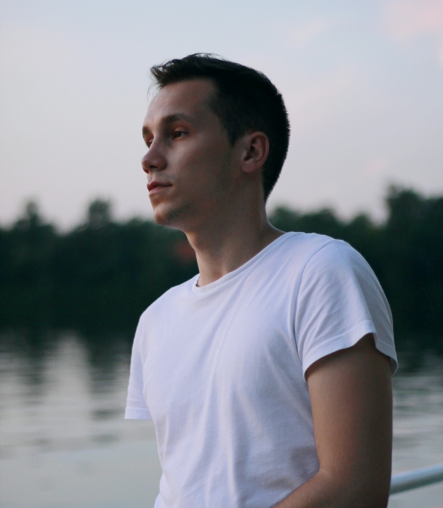

{:height="413px" width="360px"}
# **Ivan Kasenka** #

## ☎️ Contacts 

| :---     |  :---                                            |
| telegram | [@kosenya](https://t.me/kosenya)                 |
| email    | [kasenka.ivan@gmail.com](kasenka.ivan@gmail.com) |
| discord  | iva (@ivakos)                                    |
| github   | [ivakos](https://github.com/ivakos)              |

&nbsp;

## 📄 Summary 
I wanna become frontend developer. 
And improve my programming skills.
### Goals:
* to learn and develop myself; 
* start career as a junior js developer.
###  Personal qualities:
* good communication skills;
* good analytical and problem solving skills;
* attentiveness;
* mathematical thinking;
* responsibility;
* willingness to learn new useful skills.

&nbsp;

## 🔨 Skills

* Knowledge of HTML5, CSS3, JavaScript;
* Experience in cross-browser&adaptive website coding;
* Experience in working with SASS, LESS;
* Web site development experience using Visual Studio Code.  

&nbsp;

## 💾 Example of My Code
jQuery
```
(function($){
  $(function() {
    $('.menu__icon').on('click', function() {
      $(this).closest('nav')
        .toggleClass('menu_state_open');
    });
    
    $('.menu__links-item').on('click', function() {
      // do something
      $(this).closest('nav')
        .removeClass('menu_state_open');
    });
  });
})(jQuery);
```

&nbsp;

## 👨‍💻 Experience
Nowadays, I haven't so much experience in project, but I wanna change that.
## 🎓 Education

### Higher education

| :--- | :--- |
| 2015 — 2020 | **Bachelor's degree** <br> **University:** (Brest State Technical University <br> **Faculty:** Faculty of Electronic Information Systems<br> **Department:** Intelligent information technology<br> **Speciality:** Artificial Intelligence (AI) |

&nbsp;

## 📚 English 
* Pre-intermediate/Intermediate (A2/B1)
